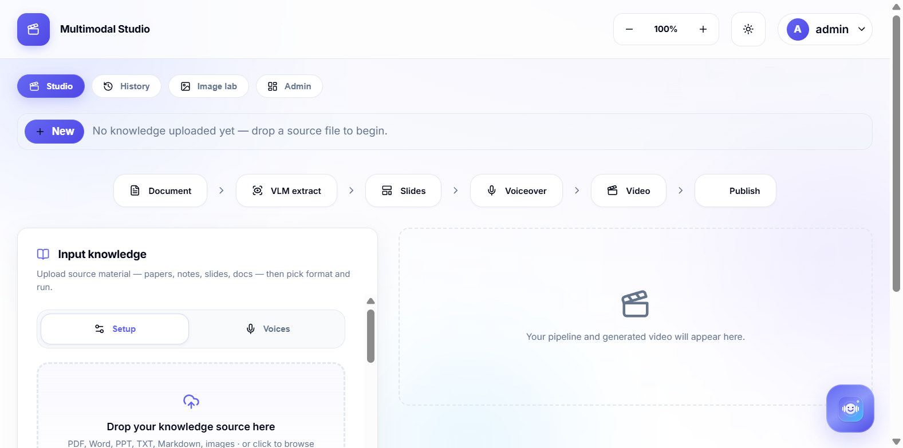
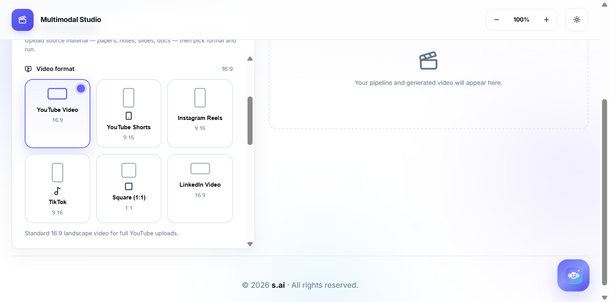
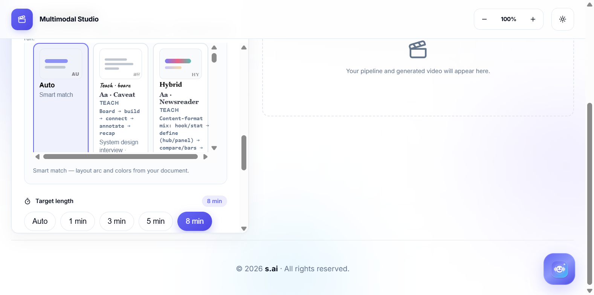
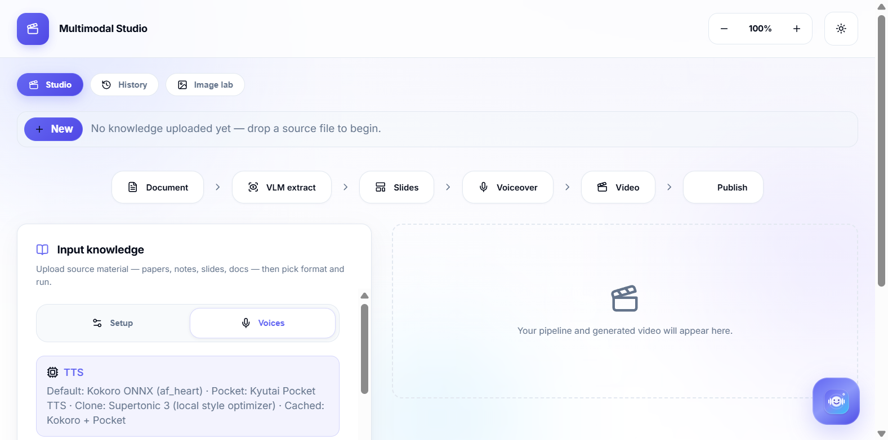
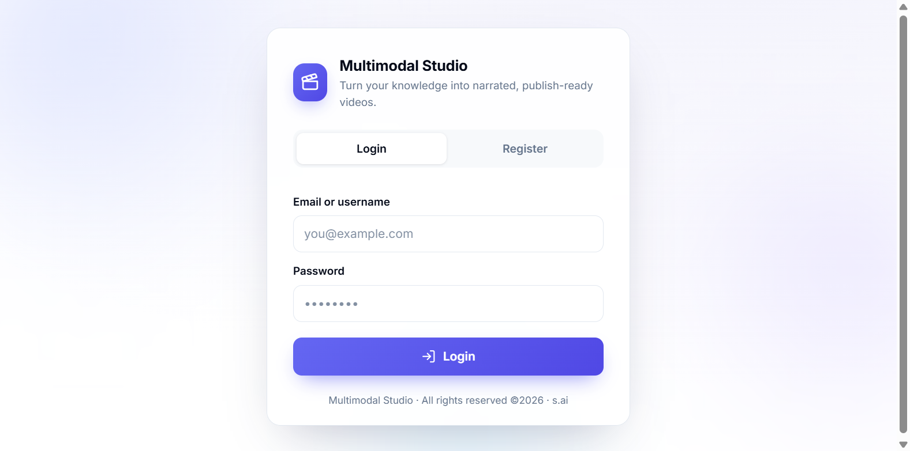
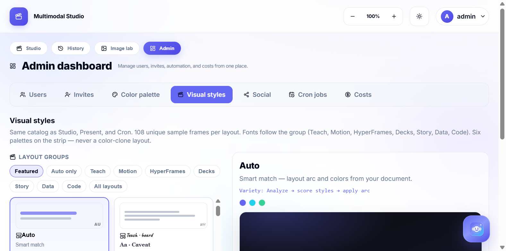
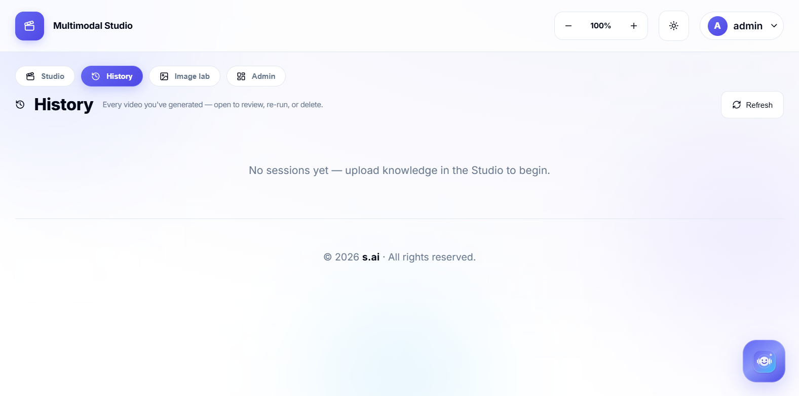
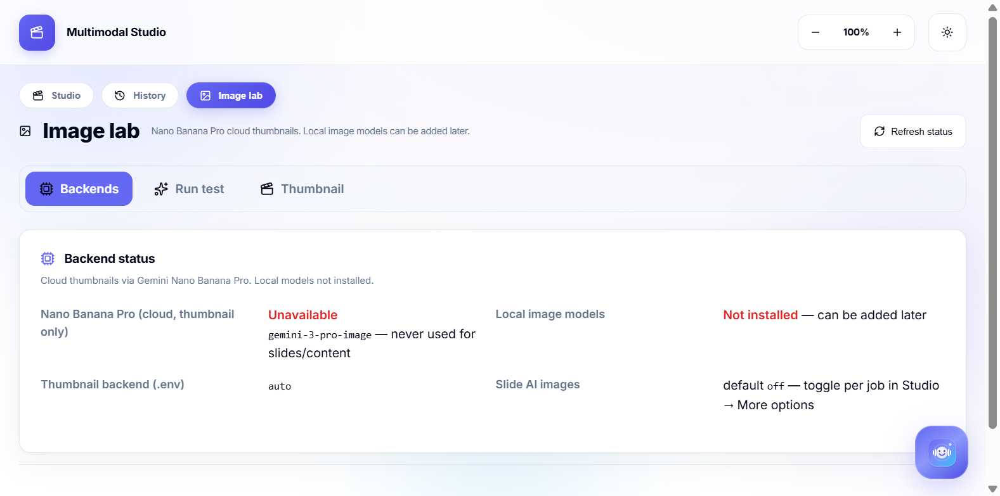

<p align="center">
  
</p>

<h1 align="center">Multimodal Studio</h1>

<p align="center">
  <strong>Turn any document into a narrated, publish-ready video.</strong><br>
  Drop a paper, notes, or slides → pick a platform → get a slideshow with voiceover, then post it.
</p>

<p align="center">
  <a href="#how-to-use">How to use</a> ·
  <a href="#what-it-can-do">What it can do</a> ·
  <a href="#run-it">Run it</a> ·
  <a href="#configure">Configure</a> ·
  <a href="#how-a-slide-fits-its-content">Slide layouts</a>
</p>

<p align="center">
  
</p>
<p align="center"><sub>Studio after sign-in: <strong>Studio · History · Image lab · Admin</strong>. Drop a source, pick a format, run Document → Extract → Slides → Voiceover → Video → Publish.</sub></p>

---

## What it can do

<table>
  <tr>
    <td width="50%">
      
      <br><sub><strong>Six export formats</strong> — YouTube 16:9, Shorts, Reels, TikTok, Square 1:1, LinkedIn. Length chips follow the platform (8 min for long-form, seconds for Shorts).</sub>
    </td>
    <td width="50%">
      
      <br><sub><strong>Visual styles</strong> — Teach, Motion, HyperFrames, Decks, Story, Data, Code. Auto picks layout + palette from the document.</sub>
    </td>
  </tr>
  <tr>
    <td>
      
      <br><sub><strong>Narration</strong> — Pocket and Kokoro catalog voices, plus record/upload clones. Preview before you run.</sub>
    </td>
    <td>
      
      <br><sub><strong>Invite-only access</strong> — sign in, or request an account an admin can approve.</sub>
    </td>
  </tr>
</table>

| Capability | What you get |
| --- | --- |
| **Ingest** | PDF, Word, PowerPoint, TXT, Markdown, images — VLM reads pages (Gemini / Ollama / OpenAI), with text fallback |
| **Teach to an audience** | Age group + knowledge level load a teaching prompt you can edit |
| **Plan long docs** | Split a book/paper into topics, research the web, then one video or many |
| **Review** | Duplicate-slide check and voice ↔ highlight sync before you ship |
| **Publish pack** | Titles, captions, tags, thumbnails for YouTube, Instagram, X, LinkedIn, TikTok, Substack, Medium |
| **Image lab** | Nano Banana Pro cloud thumbnails (Gemini). Local image models optional |
| **C.H.I.T.T.I.** | In-app voice assistant (Gemini Live) while you work |
| **Admin** | Users, invites, color palette, layout-family preview, social credentials, cron papers, costs |
| **History** | Every generated session — reopen, re-run, or delete (fills after you run the pipeline) |
| **Automation** | Admin cron: trending papers (HF / arXiv / Semantic Scholar) → overnight videos |

<p align="center">
  
</p>
<p align="center"><sub>Admin (sign-in as admin): Users, Invites, Color palette, Visual styles (one frame per layout family), Social, Cron jobs, Costs.</sub></p>

<table>
  <tr>
    <td width="50%">
      
      <br><sub><strong>History</strong> — sessions appear here after a pipeline run. Open to review, re-run, or delete.</sub>
    </td>
    <td width="50%">
      
      <br><sub><strong>Image lab</strong> — Nano Banana Pro thumbnail backends and a prompt-based test generator.</sub>
    </td>
  </tr>
</table>

---

## How to use

1. **Sign in** at `http://127.0.0.1:8001` (bootstrap admin is set in `.env`). Admins see the **Admin** tab (users, visual styles, cron, costs).
2. **Studio → drop a file** (or click the dropzone). PDF / Word / PPT / notes / images all work.
3. **Pick a video format** (YouTube, Shorts, Reels, TikTok, Square, LinkedIn) and a **target length**.
4. **Visual style** — leave **Auto**, or pick a layout family (Teach, Motion, HyperFrames, …) and a color palette.
5. **Audience** — age + knowledge, or leave Auto. Edit the teaching prompt if you want a custom tone.
6. **Voices** — preview a Pocket / Kokoro voice, or clone yours from a recording.
7. **Run pipeline**. Watch the strip: Document → VLM extract → Slides → Voiceover → Video → Publish.
8. **Review** generated slides for duplicates and voice sync. Tweak extracted text or narration and re-run a stage if needed.
9. **Publish details** — generate per-platform copy, then Post (if credentials are set) or Copy / Download.
10. **History** — every finished (or in-progress) job lands here so you can reopen it later.

**Tip:** for long PDFs, use **Plan topics** first, pick the chapters you want, then run one combined video or one video per topic.

---

## Run it

### Local

Python 3.12, FFmpeg on `PATH` (or the bundled `imageio-ffmpeg` fallback).

```bash
cp -n .env.example .env          # then set keys + admin login
bash scripts/setup_venv.sh       # uv venv + requirements.txt
source .venv/bin/activate
python run.py                    # http://127.0.0.1:8001
```

Open the URL, sign in with `AUTH_ADMIN_EMAIL` / `AUTH_ADMIN_USERNAME` + `AUTH_ADMIN_PASSWORD`.

### Docker

```bash
cp -n .env.example .env
docker compose up --build        # http://127.0.0.1:8001
```

GPU thumbnail image: `docker compose --profile gpu up --build`  
Optional local LLM: `docker compose --profile local-llm up`

---

## Configure

Copy `.env.example` → `.env`. **Never commit `.env`.**

| Setting | Purpose |
| --- | --- |
| `AUTH_ADMIN_EMAIL` / `USERNAME` / `PASSWORD` | Bootstrap admin (required) |
| `GEMINI_API_KEY` | Cloud LLM, vision extract, Nano Banana thumbnails |
| `LLM_PROVIDER` | `auto` · `gemini` · `ollama` · `openai` |
| `OLLAMA_BASE_URL` / `OLLAMA_MODEL` | Local models (e.g. `gemma4:12b`) |
| `TTS_ENGINE` | Pocket / Kokoro / clones — Studio can override per run |
| `YOUTUBE_CLIENT_SECRETS` | Path to OAuth client JSON for YouTube upload |
| `AUTO_ENABLED` | Nightly paper → video scheduler (admin) |

Social posting tokens live in `workspace/social_credentials.json` (admin UI), not in git.

---

## How a slide fits its content

The same notes do not get a recoloured copy of one card stack. Each slide is laid out from its own items — how many there are, how long each line is, and an optional importance score — so the geometry changes with the data. The visual style you pick (Teach, Motion, Decks, …) chooses the first layout family, the background motif, and the heading treatment. Two styles never share that combination.

| What you drop in | What you see |
| --- | --- |
| Four short takeaways | A treemap, an orbit, a stair, or a pinned-note scatter — whichever that style leads with, and a different one on the next slide |
| One idea much more important than the rest | That line gets the large cell; the others shrink around it |
| Three numbers (`98%`, `120ms`, `12,000 docs`) | Bar height or tile area follows the number, not a fixed three-column template |
| Ordered steps | A path, a cascade, or stacked bands, so reading order stays obvious |
| A slide with narration and no bullets | Short phrases are pulled from the narration and laid out the same way |
| A quote, diagram, or before/after | Those keep their own frame; the fitter does not restyle them |

Give a bullets slide a `weights` list (0–100, one score per bullet) when you want size to follow importance instead of sentence length:

```json
{
  "heading": "What actually moved retention",
  "layout": "bullets",
  "weights": [100, 40, 25],
  "bullets": [
    "Weekly review cut churn in half",
    "Onboarding email helped a little",
    "A redesigned logo did not"
  ],
  "narration": "The weekly review mattered most. The email helped. The logo did not."
}
```

Families the fitter can draw: treemap, orbit, cascade, masonry, path, golden split, bands, scatter, slices, skyline. A deck will not repeat a geometry, and it will not use the same family on two slides in a row.

Check it locally:

```bash
.venv/bin/python scripts/check_layout_engine.py
```

---

## Layout

```
app/            FastAPI, pipeline, auth, automation
frontend/       Studio SPA
pitch/          Capstone deck
docker/         Container entrypoint
scripts/        setup_venv.sh, e2e
docs/screenshots/
.env.example    Template only — real secrets stay in .env
```

Runtime data is local and gitignored: `workspace/` (jobs + `sessions.db`), `models/` (TTS weights), `logs/`, `automation_output/`.

---

<p align="center">
  <sub>Multimodal Studio · TSAI EAG Capstone</sub>
</p>
